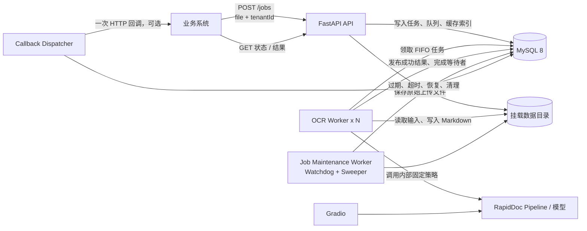
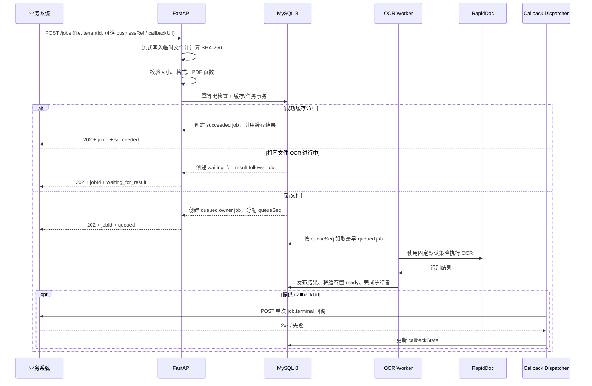
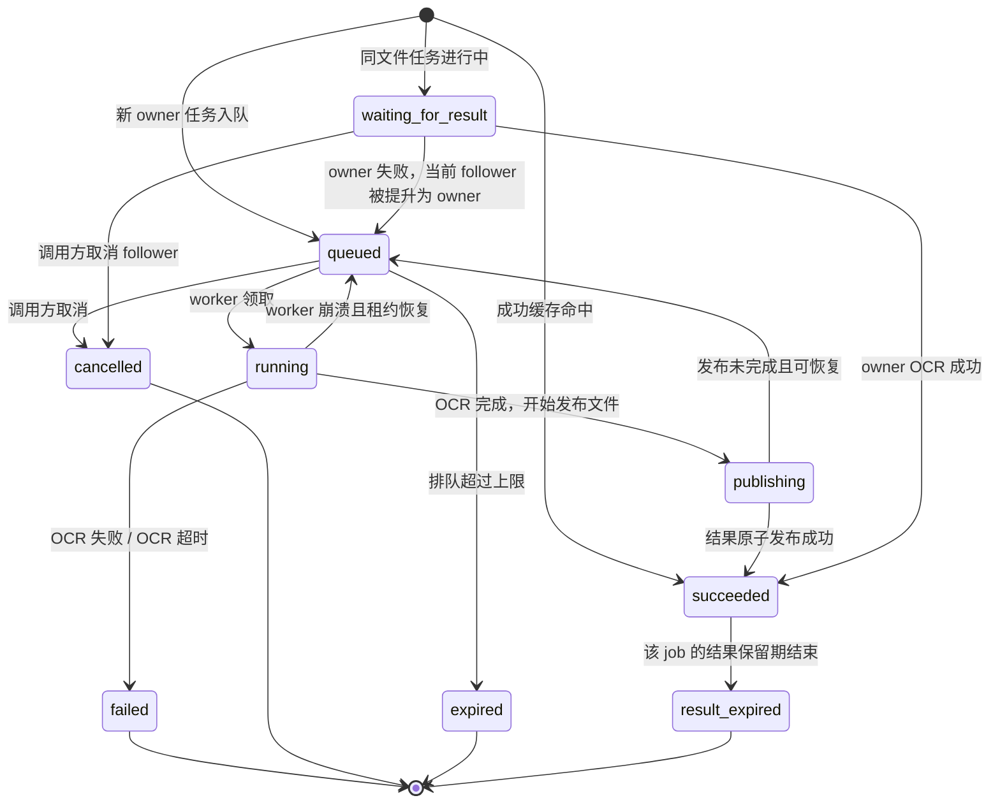
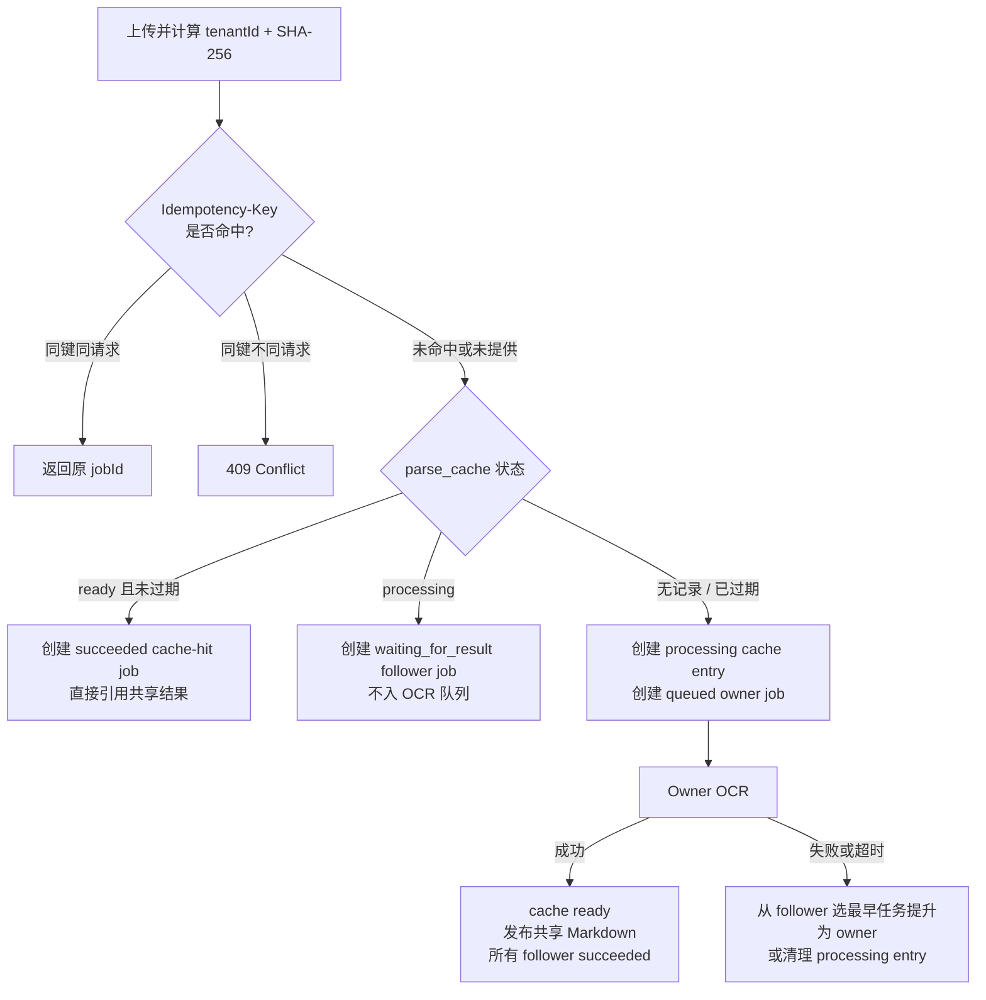

# RapidDoc 异步任务、并发控制与结果缓存设计

> 状态：**T01-T10 已全部完成并完成本地 Docker 验收；目标 AMD 服务器性能基线待部署实测**
> 文档版本：**交付验收版，2026-07-22**
> 适用范围：单机、CPU、离线私有化部署。
> 兼容性：原有 `POST /file_parse` 不修改；本设计新增独立的异步 Job API。

## 1. 目标

现有 `/file_parse` 是同步阻塞接口：上传请求会一直占用连接，直到文件转换、OCR 和 Markdown 结果生成完成。业务系统并发调用时，多个 OCR 会同时抢占 CPU、内存和磁盘，难以控制，也无法可靠地恢复中断任务。

本期增加一套异步任务能力：

- 业务方提交文件后立刻获得 `jobId`，不等待 OCR 完成。
- RapidDoc 使用持久化 FIFO 队列控制 OCR 并发，默认只有一个 OCR worker。
- 业务方通过 `jobId` 查询状态和获取 Markdown 结果；回调地址可选，且仅尝试一次。
- 同一 `tenantId` 下相同文件按 `tenantId + SHA-256(原始字节)` 复用成功结果，并合并进行中的 OCR。
- 支持文件类型、大小、PDF 页数、排队时长、OCR 执行时长、结果保留时长等配置。
- 容器重启后，排队、运行、发布中的任务可恢复；结果和队列数据保存在挂载的数据目录。

本期范围、明确后置项与后续增强事项统一见第 18 章。

## 2. 已确认的关键约定

| 项目 | 约定 |
| --- | --- |
| 保留原接口 | `/file_parse` 原样保留，仍是同步接口。 |
| 新接口 | 新增 `/jobs`、任务状态、结果、取消接口。 |
| 任务 ID | 服务端生成 ULID，例如 `01J8Y9K1D4Q7M3R6X2V5Z8ABCD`。26 位大写字母数字，无特殊符号，全局唯一。 |
| 租户 | `tenantId` 是创建任务必填字段；缓存按租户隔离。 |
| 业务引用 | `businessRef` 是创建任务可选字段，仅用于运维排查和日志关联；不参与 OCR 的任何功能决策。 |
| 幂等键 | `Idempotency-Key` 是可选请求头，与 `jobId` 无关；用于调用超时后的安全重试。 |
| 解析参数 | 新接口不向业务方暴露 OCR 语言、表格、公式、页数等策略参数，统一使用内部默认策略。 |
| 回调 | `callbackUrl` 可选；不传则不回调。传了仅投递一次，失败记录状态，不自动重试。 |
| Worker | 独立的 OCR OS 进程，不是 FastAPI/uvicorn 的 `--workers`。默认 `1` 个。 |
| 缓存键 | 逻辑键为 `tenantId + SHA-256(文件原始字节)`；数据库用两个字段和联合唯一索引实现，不直接拼字符串。 |
| 缓存范围 | 仅缓存成功结果；失败、超时、取消不缓存。 |
| 时间单位 | 面向运维配置的排队过期、结果保留、缓存保留、OCR 最大执行时长均使用“分钟”。 |

## 3. 现状与边界

当前 `docker/app.py` 的 `/file_parse` 在一个请求内完成文件转换、解析和结果组装，因此它不适合作为业务高并发调用入口。CPU slim 镜像当前分别启动 FastAPI 和 Gradio，但尚未启动异步 worker、队列恢复器或回调分发器。

新接口的第一期允许的上传扩展名如下。它是**业务准入白名单**，会比现有 RapidDoc Docker API 的实际宽泛格式集合更严格。

| 类别 | 允许扩展名 | 第一期处理方式 |
| --- | --- | --- |
| PDF | `pdf` | RapidDoc pipeline，支持自动判断文本 PDF / 扫描 PDF。 |
| Word | `doc`、`docx` | 由现有 LibreOffice 转换链路转换后走 RapidDoc。 |
| Excel | `xls`、`xlsx` | 第一期仍走现有转换/OCR 链路；后续可替换为 Python 直接提取。 |
| 图片 | `png`、`jpg`、`jpeg`、`tif`、`tiff` | 走 RapidDoc 图像 OCR。 |

服务端不能只信任文件扩展名：还应检查 MIME 类型和文件头（magic bytes），防止将伪装文件交给转换器或 OCR。

## 4. 整体架构



单容器内的关键进程如下：

1. FastAPI：仅接收 Job 请求、写入数据、查询状态和返回结果，不执行 OCR。
2. Gradio：保留现有人工测试界面。
3. OCR worker：按 FIFO 从持久化队列领取任务，执行 RapidDoc OCR。
4. Job Maintenance Worker：一个后台 OS 进程，内部包含 Watchdog 和 Sweeper 两个模块，负责恢复、超时和清理。
5. Callback dispatcher：在任务终态后投递一次可选回调；网络调用不阻塞 OCR worker。

`uvicorn --workers` 只会增加 HTTP API 进程，不应拿来提高 OCR 并发。OCR 并发由 `RAPID_DOC_WORKER_PROCESSES` 控制。每增加一个 OCR worker，通常都会多一份模型运行时和部分 PDF 图像内存；CPU 版先固定为 `1`，压测确认资源充足后再提高。

Job Maintenance Worker 不拆成两个 OS 进程，避免增加进程监管和 MySQL 行锁竞争；但内部职责和调度频率保持独立：

| 内部模块 | 职责 | 建议频率 |
| --- | --- | --- |
| `Watchdog` | `publishing` 恢复、租约过期恢复、所有格式 Job 的执行超时状态收敛。 | 每 10 秒；仅做小范围、轻量数据库检查。 |
| `Sweeper` | 排队过期、结果/缓存/墓碑/暂存文件 TTL 清理、容量统计。 | 每 60 秒；文件操作分批执行，不能长期占用数据库事务。 |

启动时先执行一次轻量恢复扫描。两类操作都必须幂等：单次维护失败只记录日志，下一轮可继续，不阻断 OCR 和 API 主流程。

## 5. Job 的完整工作原理

### 5.1 提交与处理流程



### 5.2 任务状态机



状态说明：

| `jobState` | 含义 | 可否取得结果 |
| --- | --- | --- |
| `queued` | 已进入真实 OCR FIFO 队列，等待 worker。 | 否 |
| `waiting_for_result` | 同租户相同文件已有 owner 在 OCR，本任务等待共享结果，不占用队列位置。 | 否 |
| `running` | worker 已领取，正在处理。 | 否 |
| `publishing` | OCR 已完成，正在将临时结果原子发布为正式结果。 | 否 |
| `succeeded` | OCR 或缓存复用成功。 | 是 |
| `failed` | OCR、存储或超时异常导致失败。 | 否 |
| `cancelled` | 调用方在任务开始前取消。 | 否 |
| `expired` | 排队时间超过配置上限，未开始 OCR。 | 否 |
| `result_expired` | OCR 曾成功，但该 job 的结果查询保留期已结束。 | 否，返回 `410` |

`callbackState` 与 `jobState` 是两个独立字段：OCR 成功但回调失败仍然是 `jobState=succeeded`，业务方仍可通过结果接口获取 Markdown。

| `callbackState` | 含义 |
| --- | --- |
| `not_requested` | 创建任务时没有传 `callbackUrl`。 |
| `pending` | 任务已终态，等待一次回调投递。 |
| `dispatching` | dispatcher 正在发送 HTTP 请求。 |
| `delivered` | 回调收到任意 `2xx` 响应。 |
| `failed` | 回调网络异常、超时或非 `2xx`；不再重试。 |

### 5.3 FIFO、租约和崩溃恢复

- `queueSeq` 是内部单调递增的队列序号，只用于真实 `queued` 任务的领取排序，不是 `jobId`。
- worker 用短 MySQL 事务和 `FOR UPDATE` 行锁按最小 `queueSeq` 把一个 `queued` 任务原子改为 `running`。
- worker 定期写入租约心跳。容器或 worker 崩溃后，Job Maintenance Worker 内的 Watchdog 发现租约过期，会将任务重新排队或判定失败。
- 每次领取生成新的 `attemptToken`。旧 worker 即使在失去租约后才完成，也不能覆盖新 worker 的结果。
- `RAPID_DOC_WORKER_PROCESSES=1` 时，任务开始顺序严格 FIFO；多 worker 时开始领取仍按 FIFO，但完成顺序不保证 FIFO。

`queuePosition`、`aheadQueuedCount`、`runningJobCount` 和 `workerCapacity` 会在查询状态时动态计算。它们是观察值，不是预约承诺；前面的任务取消、过期或完成后位置会变化。`waiting_for_result` 和终态任务的 `queuePosition` 为 `null`。

### 5.4 超时与取消

- 排队超时：`queued` 和 `waiting_for_result` 状态的未完成任务超过 `RAPID_DOC_QUEUE_EXPIRE_MINUTES` 都转为 `expired`，不再执行 OCR；Sweeper 会先过期 follower，再过期 owner，避免将已过期 follower 提升进 FIFO。
- OCR 执行超时：对所有格式的 owner Job 生效。超过 `RAPID_DOC_JOB_MAX_RUN_MINUTES`，Watchdog 撤销该 attempt、将任务标为 `failed` 并提升 follower；它不是 `cancelled`。维护线程不直接杀进程，而是写入原子重启信号；T09 启动监督器收到该信号后终止当前全部 OCR Worker 并按原数量重启。普通可捕获的文件处理异常仅标记 Job 失败，同一个 worker 可继续处理下一个任务，无需重启。
- 用户取消：只允许 `queued` 或 `waiting_for_result` 任务取消。已 `running` / `publishing` 的任务返回 `409 Conflict`，避免中断半完成的 OCR 和文件发布。

## 6. 缓存与相同文件合并

### 6.1 缓存键和范围

逻辑缓存键：

```text
tenantId + SHA-256(file original bytes)
```

实现时不拼接字符串，而使用：

```text
UNIQUE (tenant_id, source_sha256)
```

这样同一文件在不同租户不会互相看到或复用；同一租户下，无论文件名是否不同，只要原始字节相同即被视为同一份文件。

第一期不把语言、表格开关、公式开关、结果格式、模型版本等加入缓存键，因为它们不对外暴露，所有 `/jobs` 使用同一固定策略。服务升级模型或核心解析逻辑后，运维手动清空成功缓存即可，避免旧结果混用。

### 6.2 三种缓存路径



| 场景 | 行为 | 是否再次 OCR |
| --- | --- | --- |
| 已有 `ready` 成功缓存 | 创建一个已成功的 job，结果引用缓存 Markdown。 | 否 |
| 已有 `processing` owner | 创建 follower，状态为 `waiting_for_result`。 | 否 |
| 没有缓存 | 创建 owner，进入 FIFO 队列。 | 是 |
| owner 成功 | 写入共享结果；所有 follower 同时转 `succeeded`。 | 否 |
| owner 失败/超时 | 不写成功缓存；有 follower 时按提交顺序提升一个为新 owner。 | 只由新 owner 执行一次 |
| follower 取消 | 仅取消该 follower，不影响 owner。 | 否 |
| queued owner 取消 | 没有 follower 则清除 `processing`；有 follower 则提升最早 follower。 | 视是否有 follower |

不能采用“每个 worker OCR 前查询一次是否已有成功结果”的简化方案：两个 worker 可能在同一时刻都查不到成功结果，随后重复 OCR。`parse_cache` 的 `processing` 状态和事务内 owner/follower 决策，正是用来消除这个竞态。

### 6.3 文件与结果目录

所有目录均位于可挂载数据卷 `/app/output/jobs` 下：

```text
/app/output/jobs/
  staging/{uploadToken}.upload
  inputs/{jobId}/{storedFilename}
  attempts/{jobId}/{attemptToken}/result.json.tmp
  cache/{tenantKey}/{sourceSha256}/result.json
  cache/{tenantKey}/{sourceSha256}/result.md
```

| 路径 | 存储内容 | 用途 |
| --- | --- | --- |
| MySQL `rapid_doc` 数据库 | MySQL 元数据表 | 保存 Job 状态、队列顺序、租约、缓存索引和回调状态等元数据；不写入宿主机任务文件目录。 |
| `staging/{uploadToken}.upload` | 上传过程中的暂存文件 | API 按块写入、计算 SHA-256 并完成类型/大小/PDF 页数校验后，原子移动到对应 Job 的 `inputs` 目录；校验或入队失败时立即删除。T07 再负责清理进程异常遗留的暂存文件。 |
| `inputs/{jobId}/{storedFilename}` | 该 Job 上传的原始文件副本 | 保留经路径净化后的原始文件名，便于运维人员复核；用于容器重启后的任务恢复，以及 Owner 失败后 Follower 被提升为新 Owner 时继续 OCR。 |
| `attempts/{jobId}/{attemptToken}/result.json.tmp` | 一次 OCR 尝试产生的临时结果 | OCR 完成后先写入临时文件；进入 `publishing` 时再原子移动到正式缓存目录。崩溃恢复时据此判断结果是否完整。 |
| `cache/{tenantKey}/{sourceSha256}/result.json` | 正式结构化识别结果 | 缓存命中或 Job 结果查询时读取；包含 Markdown、页数截断提醒和其他结果元数据。 |
| `cache/{tenantKey}/{sourceSha256}/result.md` | 正式 Markdown 结果 | 供业务侧直接读取、下载或接入后续流程；内容与 `result.json` 内的 Markdown 对应。 |

- 每个 Job 保存自己的上传副本。这样 owner 失败后，follower 可以被安全提升为新 owner。
- `{storedFilename}` 优先保留用户上传的文件名；服务端会移除路径成分、控制字符和危险字符，并限制长度。后缀与文件内容检测结果不一致时，保留净化后的基础名称，但修正为已验证的扩展名，例如上传 `合同.jpg`、检测为 PDF 后保存为 `合同.pdf`。无有效基础名称时使用 `upload.{validatedExtension}`。
- 成功的正式 Markdown/JSON 只保存一份，在 `cache/...` 共享目录中。
- `tenantKey` 不能直接使用未经处理的 `tenantId` 作为路径片段；实现时需转义或使用其哈希，避免路径穿越。
- `jobs.result_path` 和 `parse_cache.result_path` 统一保存相对于数据目录的 `cache/.../result.json` 路径；Job API 以该结构化结果作为读取来源，`result.md` 仅作为同内容的便捷副本，不参与路径猜测。
- 缓存结果路径就是 OCR 成功后各个 Job 引用的最终结果路径，不再复制多份 Markdown。
- Job 的结果查询 TTL 和缓存实体 TTL 逻辑上分开：某个旧 job 的查询可以返回 `410`，而同一共享缓存仍可给后续相同文件创建新的成功 job。

未来替换方式：`CacheStore` 可增加 Redis 索引/锁，`ArtifactStore` 可把上面的本地目录替换为 MinIO；API、缓存键和 Job 状态模型不需要改变。

## 7. 默认解析策略与准入规则

### 7.1 固定内部 OCR 策略

`POST /jobs` 不暴露 `/file_parse` 的大量参数。内部统一映射为：

| RapidDoc 参数 | 固定值 |
| --- | --- |
| `backend` | `pipeline` |
| `parse_method` | `auto` |
| `lang_list` | `["ch"]` |
| `formula_enable` | `false` |
| `table_enable` | `true` |
| `return_md` | `true` |
| `return_images` | `false` |
| `response_format_zip` | `false` |
| `start_page_id` | `0` |

`auto` 会让 RapidDoc 判断 PDF：带可用文本层的 PDF 直接提取文本布局；扫描 PDF 转图后做 OCR。公式识别默认关闭，避免下载/加载不需要的公式模型。

### 7.2 准入结果

| 校验 | 不通过响应 | 是否创建 job |
| --- | --- | --- |
| 未传文件或 `tenantId` | `422 Unprocessable Entity` | 否 |
| 扩展名、MIME 或文件头不在允许范围 | `415 Unsupported Media Type` | 否 |
| 流式读取的真实文件大小超过上限 | `413 Payload Too Large` | 否 |
| 上传的 PDF 无法读取页数 | `422 Unprocessable Entity` | 否 |
| 解析 PDF 页数超过配置 | 正常受理，处理前 N 页，写入 warning | 是 |
| OCR 队列已满或任务数据目录达到预算 | `429 Too Many Requests`，含 `Retry-After` | 否 |

PDF 页数限制只对原始 `pdf` 文件生效。若 PDF 总页数大于 `RAPID_DOC_MAX_PDF_PAGES`，不拒绝任务，而是处理前 N 页，并在状态与结果元数据中写入：

```json
{
  "sourcePageCount": 80,
  "processedPageCount": 10,
  "truncated": true,
  "warnings": [
    {
      "code": "PDF_PAGE_LIMIT_TRUNCATED",
      "message": "PDF 共 80 页，已按配置仅处理前 10 页。"
    }
  ]
}
```

该提示不写进 Markdown 正文，避免污染业务内容。

## 8. 配置项

以下配置建议写入容器加载的 `/app/.env`。运维可读的时长均采用分钟；内部租约心跳和 HTTP 超时保留秒级，因为它们是程序内部控制参数。

| 配置项 | 示例 | 含义 |
| --- | ---: | --- |
| `RAPID_DOC_ASYNC_ENABLED` | `true` | 是否启用 Job API 与后台进程。 |
| `RAPID_DOC_WORKER_PROCESSES` | `1` | OCR worker OS 进程数量。 |
| `RAPID_DOC_JOB_DATA_DIR` | `/app/output/jobs` | 上传原文件、临时结果和缓存目录；Job 元数据存放在 MySQL，容器挂载任务数据盘时应保持此值与挂载目标一致。 |
| `RAPID_DOC_MAX_FILE_SIZE_MB` | `100` | 单个上传文件最大真实大小，单位 MB。 |
| `RAPID_DOC_ALLOWED_EXTENSIONS` | `pdf,doc,docx,xls,xlsx,png,jpg,jpeg,tif,tiff` | Job API 支持的扩展名白名单。 |
| `RAPID_DOC_MAX_PDF_PAGES` | `100` | 原始 PDF 最多处理前 N 页。 |
| `RAPID_DOC_QUEUE_EXPIRE_MINUTES` | `43200` | queued 状态最长等待时间，示例 30 天。 |
| `RAPID_DOC_RESULT_TTL_MINUTES` | `10080` | 每个成功 job 的结果可查询时长，示例 7 天。 |
| `RAPID_DOC_CACHE_TTL_MINUTES` | `43200` | 成功缓存保留时长，示例 30 天；应不小于结果 TTL。 |
| `RAPID_DOC_JOB_MAX_RUN_MINUTES` | `60` | 单个 owner Job 的最大执行时长，适用于 PDF、Office 文件和图片。 |
| `RAPID_DOC_TOMBSTONE_TTL_MINUTES` | `43200` | 结果删除后仍保留状态摘要的时长。 |
| `RAPID_DOC_JOB_MAX_PROCESSING_ATTEMPTS` | `2` | 崩溃恢复等可重试处理的最大 attempt 数。 |
| `RAPID_DOC_JOB_LEASE_SECONDS` | `60` | worker 持有任务的内部租约时长。 |
| `RAPID_DOC_JOB_HEARTBEAT_SECONDS` | `30` | worker 内部续租间隔。 |
| `RAPID_DOC_MAINTENANCE_WATCHDOG_INTERVAL_SECONDS` | `10` | Job Maintenance Worker 内 Watchdog 的检查间隔。 |
| `RAPID_DOC_MAINTENANCE_SWEEPER_INTERVAL_SECONDS` | `60` | Job Maintenance Worker 内 Sweeper 的清理间隔。 |
| `RAPID_DOC_CALLBACK_CONNECT_TIMEOUT_SECONDS` | `5` | 回调连接超时。 |
| `RAPID_DOC_CALLBACK_READ_TIMEOUT_SECONDS` | `30` | 回调响应读取超时。 |
| `RAPID_DOC_CALLBACK_SIGNING_SECRET` | 空 | 可选 HMAC-SHA256 签名密钥；设置后回调请求附带 `X-RapidDoc-Signature`。 |

队列与存储保护第一期不暴露为运维配置，而是在 `JobAdmissionLimits` 常量类中固定：`MAX_QUEUED_JOBS = 100`，只统计 `job_state=queued` 的实际 OCR 队列；`MAX_RETAINED_BYTES = 10 * 1024 * 1024 * 1024`，统计 `/app/output/jobs` 下的输入、临时文件和缓存结果。达到任一上限时拒绝新的需入队 Job；调整这些值需随代码版本发布。

排队过期、结果保留和缓存保留不能合并为一个配置：它们服务的生命周期不同。排队过期用于避免几十天前的任务突然消耗资源；结果 TTL 控制某个 job 何时不可查询；缓存 TTL 控制同租户相同文件是否仍可免 OCR。

> TODO（后续安全增强，不属于本期）：当前仅校验 `callbackUrl` 的基本 URL 格式；内网部署暂不实现回调域名白名单、CIDR 出站限制、HTTP/HTTPS 限制及 DNS 重绑定防护。对外网、跨网络边界或多租户部署前，必须补齐这些限制。

## 9. MySQL 表设计

MySQL 仅存任务元数据、索引、状态和小型回调载荷；上传文件与 Markdown 存文件系统。第一期使用 InnoDB、短事务和行级锁。OCR 的秒/分钟级耗时远大于 MySQL 的毫秒级写入，数据库不会持有 OCR 长事务。

### 9.1 `jobs`

| 字段 | 类型/约束 | 含义 |
| --- | --- | --- |
| `job_id` | `VARCHAR(26) PRIMARY KEY` | ULID，全局唯一。 |
| `tenant_id` | `TEXT NOT NULL` | 租户标识。 |
| `queue_seq` | `INTEGER UNIQUE NULL` | 实际进入 OCR FIFO 时分配的递增序号；缓存命中/follower 初始为空。 |
| `idempotency_key_hash` | `TEXT NULL` | 可选幂等键哈希。联合租户唯一。 |
| `request_fingerprint` | `TEXT NOT NULL` | 用于判断同一幂等键是否对应同一请求。 |
| `source_filename` | `TEXT NOT NULL` | 原始文件名，仅展示用途。 |
| `stored_filename` | `TEXT NOT NULL` | 路径净化、必要时按检测结果修正后，实际保存在 `inputs/{jobId}/` 下的文件名。 |
| `business_ref` | `TEXT NULL` | 可选业务引用，仅供运维排查和日志关联，不参与任何 Job 功能判断。 |
| `source_sha256` | `TEXT NOT NULL` | 原始字节 SHA-256。 |
| `source_bytes` | `INTEGER NOT NULL` | 实际上传字节数。 |
| `job_state` | `TEXT NOT NULL` | 任务状态机字段。 |
| `cache_role` | `TEXT NOT NULL` | `owner`、`follower`、`hit`。 |
| `callback_url` | `TEXT NULL` | 可选回调地址快照。 |
| `processing_attempt` | `INTEGER NOT NULL` | 已领取处理次数。 |
| `active_attempt_token` | `TEXT NULL` | 当前 worker attempt 的 CAS 令牌。 |
| `lease_expires_at` | `INTEGER NULL` | 内部租约到期时间。 |
| `result_path` | `TEXT NULL` | 共享 JSON / Markdown 最终路径。 |
| `source_page_count` | `INTEGER NULL` | 原始 PDF 总页数。 |
| `processed_page_count` | `INTEGER NULL` | 实际处理页数。 |
| `truncated` | `INTEGER NOT NULL` | 是否因 PDF 页数限制截断。 |
| `warnings_json` | `TEXT NULL` | 页数截断等结构化提示。 |
| `result_expires_at` | `INTEGER NULL` | 本 job 结果查询截止时间。 |
| `tombstone_expires_at` | `INTEGER NULL` | 状态摘要清理时间。 |
| `submitted_at`、`started_at`、`finished_at` | `INTEGER` | 生命周期时间戳。 |
| `error_code`、`error_message` | `TEXT NULL` | 终态失败原因。 |

`jobs` 表共 28 列。下列信息仍会在上传、Worker 或查询阶段使用，但不再重复持久化到主表：

- 文件实际扩展名从已校正的 `stored_filename` 推导；上传准入阶段仍按已验证格式进行分流。
- 原始输入路径由 `ArtifactStore.input_path(jobId, storedFilename)` 确定，避免数据目录迁移后保存旧的绝对路径。
- `cache.resultSource` 由 `cache.role` 在查询响应中推导：成功的 `owner` 为 `ocr`、`follower` 为 `shared_inflight`、`hit` 为 `cache`；未成功时为 `null`。
- 当前 Worker 身份保留在进程日志和 `service_heartbeats` 中；Job 的独占与恢复仍只依赖 `active_attempt_token` 和 `lease_expires_at`。
- 结果大小从结果文件或 `parse_cache.result_bytes` 读取，避免与 `jobs` 重复保存。

关键约束与索引：

```text
UNIQUE (tenant_id, idempotency_key_hash) WHERE idempotency_key_hash IS NOT NULL
INDEX  jobs(job_state, queue_seq)
INDEX  jobs(tenant_id, job_id)
INDEX  jobs(result_expires_at)
INDEX  jobs(lease_expires_at)
```

### 9.2 `parse_cache`

| 字段 | 类型/约束 | 含义 |
| --- | --- | --- |
| `tenant_id` | `TEXT NOT NULL` | 缓存隔离维度。 |
| `source_sha256` | `TEXT NOT NULL` | 文件原始字节摘要。 |
| `cache_state` | `TEXT NOT NULL` | `processing`、`ready`。 |
| `owner_job_id` | `TEXT NULL` | 当前负责 OCR 的 owner job。 |
| `result_path` | `TEXT NULL` | 成功后共享结果路径。 |
| `result_bytes` | `INTEGER NULL` | 共享结果大小。 |
| `created_at`、`last_accessed_at` | `INTEGER NOT NULL` | 缓存生命周期与淘汰依据。 |
| `expires_at` | `INTEGER NOT NULL` | 缓存失效时间。 |

```text
PRIMARY KEY (tenant_id, source_sha256)
INDEX parse_cache(cache_state, expires_at)
```

`processing` 不等于成功缓存：它只是互斥锁和 owner/follower 关系记录。只有 OCR 成功后才转 `ready`。失败、超时或所有候选任务被取消时，不留下成功缓存。

### 9.3 `callback_outbox`

| 字段 | 类型/约束 | 含义 |
| --- | --- | --- |
| `delivery_id` | `TEXT PRIMARY KEY` | 回调投递唯一 ID。 |
| `job_id` | `TEXT UNIQUE NOT NULL` | 一个终态 job 最多一条回调记录。 |
| `callback_url_snapshot` | `TEXT NOT NULL` | 创建 job 时保存的地址。 |
| `payload_json` | `TEXT NOT NULL` | 固定的回调报文。 |
| `callback_state` | `TEXT NOT NULL` | `pending`、`dispatching`、`delivered`、`failed`。 |
| `attempted_at` | `INTEGER NULL` | 唯一一次调用的发生时间。 |
| `http_status` | `INTEGER NULL` | HTTP 响应码。 |
| `error_code`、`error_message` | `TEXT NULL` | 网络或非 2xx 错误。 |

只有 `callbackUrl` 非空时才创建 outbox。终态写入和 outbox 创建在同一个 MySQL 事务中，避免“已成功但漏回调”的崩溃窗口。

### 9.4 `service_heartbeats`

| 字段 | 含义 |
| --- | --- |
| `component_type`、`component_id` | API、worker、dispatcher、maintenance worker 的类型和实例 ID。 |
| `pid` | 进程号。 |
| `component_state` | 存活/停止/异常状态。 |
| `last_seen_at` | 最近心跳。 |
| `details_json` | 队列、版本、异常等诊断扩展信息。 |

## 10. API 文档

### 10.1 调用身份和租户隔离

创建接口在 multipart body 中传 `tenantId`。读取、结果和取消接口必须带 `X-Tenant-Id`，并且与创建时的租户一致；不一致时按 `404` 返回，避免暴露任务是否存在。

`tenantId` 本身不是身份认证。生产部署应由 API 网关、mTLS 或业务鉴权令牌校验调用方，再把可信租户上下文映射为该字段/请求头。不能把可随意伪造的租户字符串当作安全边界。

### 10.2 `POST /jobs`：创建任务

**请求**：`multipart/form-data`

| 字段/请求头 | 位置 | 必填 | 含义 |
| --- | --- | --- | --- |
| `file` | form-data | 是 | 上传的一个文件。 |
| `tenantId` | form-data | 是 | 业务租户 ID，也是缓存隔离维度。 |
| `businessRef` | form-data | 否 | 业务侧自定义引用号，仅供运维排查；不用于缓存、幂等、排队、权限、回调或结果查询。建议限制为最多 128 个可打印字符，避免填写敏感信息。 |
| `callbackUrl` | form-data | 否 | 终态后接收一次回调的地址。未提供则不回调。 |
| `Idempotency-Key` | HTTP Header | 否 | 同一业务提交重试时保持不变，防止重复创建 job；与服务端 `jobId` 无关。 |

**示例请求**：

```bash
curl -X POST 'http://rapid-doc.internal:8000/jobs' \
  -H 'Idempotency-Key: upload-20260716-000123' \
  -F 'tenantId=finance' \
  -F 'businessRef=contract-import-20260716-001' \
  -F 'callbackUrl=https://biz.internal/rapid-doc/callback' \
  -F 'file=@./contract.pdf;type=application/pdf'
```

**普通入队响应**：`202 Accepted`

```json
{
  "jobId": "01J8Y9K1D4Q7M3R6X2V5Z8ABCD",
  "jobState": "queued",
  "callbackState": "pending",
  "cache": {
    "role": "owner",
    "resultSource": null
  },
  "submittedAt": "2026-07-16T10:30:00Z",
  "statusUrl": "/jobs/01J8Y9K1D4Q7M3R6X2V5Z8ABCD",
  "resultUrl": "/jobs/01J8Y9K1D4Q7M3R6X2V5Z8ABCD/result",
  "cancelUrl": "/jobs/01J8Y9K1D4Q7M3R6X2V5Z8ABCD/cancel"
}
```

**缓存命中响应**：仍为 `202 Accepted`，但任务已是成功状态。这样调用方始终按同一种“创建后查询/取结果”模型处理。

```json
{
  "jobId": "01J8Y9QK6V0AZMK1D2Y5P3N7XR",
  "jobState": "succeeded",
  "callbackState": "pending",
  "cache": {
    "role": "hit",
    "resultSource": "cache"
  },
  "submittedAt": "2026-07-16T10:31:00Z",
  "statusUrl": "/jobs/01J8Y9QK6V0AZMK1D2Y5P3N7XR",
  "resultUrl": "/jobs/01J8Y9QK6V0AZMK1D2Y5P3N7XR/result",
  "cancelUrl": "/jobs/01J8Y9QK6V0AZMK1D2Y5P3N7XR/cancel"
}
```

**典型错误响应**：

```json
{
  "error": {
    "code": "FILE_TOO_LARGE",
    "message": "文件大小超过 RAPID_DOC_MAX_FILE_SIZE_MB=100 的限制。"
  }
}
```

| HTTP 状态 | 错误码示例 | 含义 |
| --- | --- | --- |
| `409` | `IDEMPOTENCY_KEY_REUSED_WITH_DIFFERENT_REQUEST` | 同一租户的同一个幂等键对应了不同文件或不同回调请求。 |
| `413` | `FILE_TOO_LARGE` | 上传实际大小超限。 |
| `415` | `UNSUPPORTED_FILE_TYPE` | 格式不在白名单或内容类型不匹配。 |
| `422` | `INVALID_TENANT_ID`、`INVALID_CALLBACK_URL`、`INVALID_PDF` | 字段、回调地址或 PDF 不合法。 |
| `429` | `QUEUE_CAPACITY_EXCEEDED`、`STORAGE_CAPACITY_EXCEEDED` | 队列或保留存储空间不足，响应带 `Retry-After`。 |

### 10.3 `GET /jobs/{jobId}`：查询状态

**请求头**：`X-Tenant-Id: finance`

**响应字段**：

| 字段 | 含义 |
| --- | --- |
| `jobId` | 服务端生成的 ULID。 |
| `jobState` | 当前 Job 状态。 |
| `callbackState` | 回调状态；未请求回调时为 `not_requested`。 |
| `queueSeq` | OCR 队列序号；尚未入队/无需入队时为 `null`。 |
| `queuePosition` | 当前排队位置，从 1 开始；非 `queued` 时为 `null`。 |
| `aheadQueuedCount` | 当前前面仍在排队的真实 OCR 任务数。 |
| `runningJobCount` | 当前正在 OCR 的任务数。 |
| `workerCapacity` | 当前配置的 worker 数。 |
| `cache.role` | `owner`、`follower`、`hit`。 |
| `cache.resultSource` | 成功后为 `ocr`、`shared_inflight` 或 `cache`。 |
| `sourcePageCount`、`processedPageCount`、`truncated` | 原始 PDF 的页数处理信息；非 PDF 的前两项为 `null`，`truncated=false`。 |
| `warnings` | 例如页数截断提示。 |
| `submittedAt`、`startedAt`、`finishedAt` | 生命周期时间。 |
| `queueDurationSeconds` | 排队等待耗时；任务尚未开始时按当前查询时间计算。 |
| `runDurationSeconds` | OCR 执行耗时；任务尚未开始时为 `null`，执行中按当前查询时间计算。 |
| `totalDurationSeconds` | 从提交到结束或当前查询时间的总耗时。 |
| `resultUrl` | 获取完整 Markdown/JSON 的地址。 |
| `error` | 失败、过期或超时时的错误对象；成功时为 `null`。 |

**排队中示例**：

```json
{
  "jobId": "01J8Y9K1D4Q7M3R6X2V5Z8ABCD",
  "jobState": "queued",
  "callbackState": "not_requested",
  "queueSeq": 42,
  "queuePosition": 3,
  "aheadQueuedCount": 2,
  "runningJobCount": 1,
  "workerCapacity": 1,
  "cache": {
    "role": "owner",
    "resultSource": null
  },
  "sourcePageCount": 80,
  "processedPageCount": 10,
  "truncated": true,
  "warnings": [
    {
      "code": "PDF_PAGE_LIMIT_TRUNCATED",
      "message": "PDF 共 80 页，已按配置仅处理前 10 页。"
    }
  ],
  "submittedAt": "2026-07-16T10:30:00Z",
  "startedAt": null,
  "finishedAt": null,
  "resultUrl": "/jobs/01J8Y9K1D4Q7M3R6X2V5Z8ABCD/result",
  "error": null
}
```

**成功示例**：

```json
{
  "jobId": "01J8Y9K1D4Q7M3R6X2V5Z8ABCD",
  "jobState": "succeeded",
  "callbackState": "delivered",
  "queueSeq": 42,
  "queuePosition": null,
  "aheadQueuedCount": 0,
  "runningJobCount": 0,
  "workerCapacity": 1,
  "cache": {
    "role": "owner",
    "resultSource": "ocr"
  },
  "sourcePageCount": 80,
  "processedPageCount": 10,
  "truncated": true,
  "warnings": [
    {
      "code": "PDF_PAGE_LIMIT_TRUNCATED",
      "message": "PDF 共 80 页，已按配置仅处理前 10 页。"
    }
  ],
  "submittedAt": "2026-07-16T10:30:00Z",
  "startedAt": "2026-07-16T10:31:15Z",
  "finishedAt": "2026-07-16T10:33:10Z",
  "resultUrl": "/jobs/01J8Y9K1D4Q7M3R6X2V5Z8ABCD/result",
  "error": null
}
```

这三个页数字段不用于 Word、Excel 或图片：即使内部转换链路临时生成 PDF，也不暴露转换后的页数，避免将其误解为原始文件元数据。非 PDF 不产生 `PDF_PAGE_LIMIT_TRUNCATED` warning；后续如需返回工作表、行数等类型专属信息，应增加通用 `documentMeta`，不复用 PDF 页数字段。

### 10.4 `GET /jobs/{jobId}/result`：获取结果

**请求头**：`X-Tenant-Id: finance`

| 当前状态 | HTTP 状态 | 响应 |
| --- | --- | --- |
| `queued`、`waiting_for_result`、`running`、`publishing` | `202` | `{ "jobState": "...", "result": null }` |
| `succeeded` | `200` | 完整 Markdown、结构化结果和元数据。 |
| `failed`、`cancelled`、`expired` | `409` | 错误对象。 |
| `result_expired` | `410` | 结果已按 TTL 清理。 |
| 不存在或租户不匹配 | `404` | 不暴露任务信息。 |

**成功响应示例**：

```json
{
  "jobId": "01J8Y9K1D4Q7M3R6X2V5Z8ABCD",
  "jobState": "succeeded",
  "result": {
    "markdown": "# 合同\n\n甲方：...\n",
    "metadata": {
      "sourcePageCount": 80,
      "processedPageCount": 10,
      "truncated": true,
      "warnings": [
        {
          "code": "PDF_PAGE_LIMIT_TRUNCATED",
          "message": "PDF 共 80 页，已按配置仅处理前 10 页。"
        }
      ],
      "resultSource": "ocr"
    }
  }
}
```

### 10.5 `POST /jobs/{jobId}/cancel`：取消未开始任务

**请求头**：`X-Tenant-Id: finance`

| 状态 | 行为 |
| --- | --- |
| `queued`、`waiting_for_result` | 返回 `200`，转为 `cancelled`。 |
| `running`、`publishing` | 返回 `409`，不强制中断正在运行的 OCR。 |
| 已终态 | 返回 `409`。 |
| 不存在或租户不匹配 | 返回 `404`。 |

**成功响应示例**：

```json
{
  "jobId": "01J8Y9K1D4Q7M3R6X2V5Z8ABCD",
  "jobState": "cancelled",
  "cancelledAt": "2026-07-16T10:30:15Z"
}
```

### 10.6 可选回调报文

回调仅在创建时提供 `callbackUrl` 时发生，任务到达首次业务终态（`succeeded`、`failed`、`cancelled`、`expired`）后投递一次。任意 `2xx` 表示成功；网络错误、超时或非 `2xx` 记为 `failed`，不重试。结果保留期结束的 `result_expired` 不会再发第二次终态回调。

Dispatcher 先在 MySQL 中把 `pending` 原子改为 `dispatching`，再发出 HTTP 请求，因此语义是 **at-most-once**：进程在发出请求后崩溃时，该记录会停留在 `dispatching`，系统不会冒着重复通知的风险自动重试，运维可据此人工核对。设置 `RAPID_DOC_CALLBACK_SIGNING_SECRET` 后使用该密钥对 JSON 原始字节做 HMAC-SHA256；未设置时不发送签名头。

```http
POST /rapid-doc/callback HTTP/1.1
Content-Type: application/json
X-RapidDoc-Delivery-Id: 01J8YA7HX2P0K4F8M6N3Q9R5TV
X-RapidDoc-Timestamp: 2026-07-16T10:33:11Z
X-RapidDoc-Signature: v1=<HMAC-SHA256>
```

```json
{
  "deliveryId": "01J8YA7HX2P0K4F8M6N3Q9R5TV",
  "eventType": "job.terminal",
  "jobId": "01J8Y9K1D4Q7M3R6X2V5Z8ABCD",
  "jobState": "succeeded",
  "submittedAt": "2026-07-16T10:30:00Z",
  "startedAt": "2026-07-16T10:31:15Z",
  "finishedAt": "2026-07-16T10:33:10Z",
  "resultUrl": "/jobs/01J8Y9K1D4Q7M3R6X2V5Z8ABCD/result",
  "error": null
}
```

回调只是提醒，业务方的可靠结果来源始终是 `GET /jobs/{jobId}` 与 `GET /jobs/{jobId}/result`。

## 11. 幂等键与 Job ID

`jobId` 由服务端在任务创建时生成。它与调用方的 `Idempotency-Key` 不存在编码或推导关系。

| 情况 | 服务端行为 |
| --- | --- |
| 未传 `Idempotency-Key` | 正常创建新 Job；随后由文件缓存决定是否复用 OCR 结果。 |
| 同租户、同幂等键、同一请求重试 | 返回首次创建的同一个 `jobId`，不新增任务。 |
| 同租户、同幂等键、请求内容不同 | `409 Conflict`，防止业务方错误复用键。 |
| 不同租户使用相同幂等键 | 可以，各租户独立。 |

请求指纹至少包含 `tenantId`、文件 SHA-256 和规范化后的可选回调地址。`businessRef` 明确不纳入请求指纹，也不参与缓存、排队、权限或回调载荷。`Idempotency-Key` 在数据库中仅保存哈希，不保存明文。

`Idempotency-Key` 解决“同一次上传请求重试”问题；缓存解决“同租户相同文件是否重复 OCR”问题。二者互补，不能互相替代。

## 12. 结果发布、恢复与清理

OCR 结果先写入 attempt 专属临时路径，再通过状态 CAS 和原子 rename 发布到缓存最终路径。之所以保留 `publishing`，是因为 MySQL 事务与文件系统 rename 无法形成同一个真正的原子事务。

恢复规则：

| 异常场景 | 恢复方式 |
| --- | --- |
| worker 在 `running` 崩溃 | 租约过期后重新排队，直到达到最大 attempt。 |
| worker 在 `publishing` 崩溃，最终文件存在 | 补全数据库状态为 `succeeded`。 |
| worker 在 `publishing` 崩溃，只有完整临时文件 | 原子 rename 后补全 `succeeded`。 |
| 输入文件丢失 | Job 转 `failed`，错误为 `STORAGE_INPUT_MISSING`。 |
| 结果文件丢失 | Job 查询返回 `410` 或转为可查询的存储错误；不发送矛盾的第二次终态回调。 |
| 缓存 TTL 到期 | 清理无引用或所有引用 job 均过期的缓存结果和 `parse_cache` 记录。 |

T07 已实现上述数据库与文件收敛：临时 JSON 完整时补写 Markdown 并发布，最终 JSON 已存在时补全数据库状态；两者都不存在时按 attempt 上限重新排队或失败。T09 已将 OCR 超时后的进程处理接入启动监督器：Watchdog 标记超时 Job 后，在数据目录的 `control/restart-workers.request` 写入原子重启信号；启动脚本会对当前全部 OCR Worker 发送 `TERM`，再按原数量拉起新 Worker。API、Gradio、维护和回调进程不会因此被终止。

清理顺序必须保证：仍可查询结果的 job 不能先于其共享结果被删除。物理缓存结果可以在最后一个逻辑引用到期后再删除。

## 13. 可观测性与后续运维接口

本期至少提供：

- `GET /health/live`：FastAPI 存活。
- `GET /health/ready`：MySQL 可用、数据目录可写、worker/dispatcher/maintenance worker 心跳新鲜、容量未满。
- `GET /ops/jobs/queue`：返回全部真实 OCR 排队任务，按 `queue_seq ASC` 排序。仅返回 `job_state=queued`，不包含 `running`、`waiting_for_result`、缓存命中或终态 Job。
- 结构化日志：`jobId`、可选 `businessRef`、`queueSeq`、状态变化、worker ID、attempt、排队等待时长、执行时长、缓存命中类型、回调结果。容器同时将各进程日志写入 `RAPID_DOC_LOG_DIR`，默认是 `/app/output/jobs/logs`，按 100MB 轮转并保留 15 天。

`GET /ops/jobs/queue` 不接受 `tenantId`，必须只通过运维网关或受控内网暴露，不能直接提供给业务调用方。当前固定队列上限为 100，因此第一期不分页。响应保持精简：

```json
{
  "generatedAt": "2026-07-21T14:30:00Z",
  "queuedCount": 3,
  "runningJobCount": 1,
  "workerCapacity": 1,
  "items": [
    {
      "queuePosition": 1,
      "jobId": "J20260721000042K7M4",
      "tenantId": "finance",
      "sourceFilename": "合同.pdf",
      "submittedAt": "2026-07-21T14:20:10Z"
    }
  ]
}
```

### 13.1 已实现的进程编排与就绪判定

CPU slim 启动脚本会统一监管 API、Gradio、`RAPID_DOC_WORKER_PROCESSES` 个 OCR Worker、一个 Maintenance Worker 和一个 Callback Dispatcher。任意子进程退出后，启动脚本记录组件名、PID 与退出码，等待一秒后只重启该组件。容器收到 `TERM` 或 `INT` 时会先停止全部子进程，再退出 PID 1 脚本。

三个后台角色会以 `service_heartbeats` 表记录 `running` 心跳。心跳新鲜窗口固定为 `max(60 秒, 3 × RAPID_DOC_JOB_HEARTBEAT_SECONDS)`，不新增额外运维配置。`GET /health/ready` 返回 `200` 的条件是：MySQL 可读写、任务数据目录可写、保留容量未满，且所需数目的 OCR Worker、Maintenance Worker、Callback Dispatcher 均有新鲜 `running` 心跳；任一条件不满足时返回 `503` 与逐项 `checks`。`GET /health/live` 只确认 FastAPI 进程可响应。

批量取消、按条件筛选、完整任务列表和队列管理页面属于后续运维能力，不阻塞本期核心 Job API。现阶段可以按 `tenant_id + business_ref` 查询 MySQL 或结构化日志排查；本期不提供按 `businessRef` 查询 Job 的业务 API，也不把它作为文件批处理语义。

## 14. 容器与挂载建议

模型仍保留在镜像 `/app/models` 内，不挂载到宿主机。异步 Job 版本交付后，为支持纯代码热更新，宿主机建议按以下方式组织：

```text
/opt/rapid-doc/config/.env
/opt/rapid-doc/release/                 # 自定义应用代码、SQL、启动脚本
/data/rapid-doc/jobs/                   # 任务文件、结果、缓存；元数据在 MySQL
```

| 宿主机 | 容器 | 用途 |
| --- | --- | --- |
| `/opt/rapid-doc/config/.env` | `/app/.env:ro` | 运维配置。 |
| `/opt/rapid-doc/release` | `/opt/rapid-doc/release:ro` | 自定义应用代码、SQL 和启动脚本。 |
| `/data/rapid-doc/jobs` | `/app/output/jobs` | 上传文件、任务结果和缓存；MySQL 不挂载到宿主机。 |

容器启动时让自定义代码优先被 Python 发现，并使用挂载目录中的启动脚本：

```bash
docker run ... \
  -v /opt/rapid-doc/config/.env:/app/.env:ro \
  -v /opt/rapid-doc/release:/opt/rapid-doc/release:ro \
  -v /data/rapid-doc/jobs:/app/output/jobs \
  -e PYTHONPATH=/opt/rapid-doc/release:/app \
  --entrypoint /bin/bash \
  rapid-doc:cpu-slim-amd64 \
  /opt/rapid-doc/release/start_api_gradio_cpu_slim.sh
```

挂载的启动脚本应启动 `/opt/rapid-doc/release/app.py`；自定义模块由 `PYTHONPATH` 优先解析，原项目的 `rapid_doc` 代码仍从镜像 `/app/rapid_doc` 导入。通过 `/bin/bash` 解释挂载脚本，避免宿主机文件系统未保留可执行位时发生 `permission denied`。不要整体挂载 `/app` 或 `/app/rapid_doc`，否则会遮蔽镜像内的原始代码、依赖或模型文件。

不挂载模型不会影响后续代码、SQL、配置和任务文件的更新。仅变更 `/opt/rapid-doc/release` 中的代码或 SQL，或变更 `.env` 配置时，同步文件后执行 `docker restart rapid-doc` 即可生效；若变更 Python 依赖、系统依赖、模型或基础镜像，仍需重新构建并导入新镜像。

## 15. 实施边界与建议文件

建议新增以下模块，保持原 RapidDoc 主代码改动尽量集中：

| 文件 | 职责 |
| --- | --- |
| `rapid_doc/jobs/job_config.py` | `.env` 加载、分钟到内部秒数的转换和配置校验。 |
| `rapid_doc/jobs/job_admission.py` | 文件准入、落盘、固定策略的 PDF 页数限制。 |
| `rapid_doc/jobs/job_limits.py` | `JobAdmissionLimits` 常量类：OCR 队列数量和任务数据目录预算。 |
| `rapid_doc/jobs/job_schema_mysql.sql` | MySQL 8 表、索引和约束。 |
| `rapid_doc/jobs/job_store.py` | Job、缓存、outbox 的短事务与状态 CAS。 |
| `rapid_doc/jobs/job_parser.py` | 固定解析策略到既有 RapidDoc `aio_do_parse` 的适配。 |
| `rapid_doc/jobs/job_worker.py` | FIFO 领取、租约、OCR、发布、owner/follower 提升。 |
| `rapid_doc/jobs/job_maintenance.py` | 一个后台进程；内部的 Watchdog 处理发布恢复、租约和执行超时状态收敛，Sweeper 处理 TTL、缓存与文件清理。worker 进程重启由 T09 启动监督器负责。 |
| `rapid_doc/jobs/job_callback.py` | 单次回调、地址校验、签名和状态记录。 |
| `rapid_doc/jobs/job_runtime.py` | 后台进程心跳、就绪检查和 MySQL/数据目录探测。 |
| `docker/app.py` | 新 Job API、结果/状态接口、健康接口；`/file_parse` 保持不变。 |
| `docker/start_api_gradio_cpu_slim.sh` | 统一拉起并监管 API、Gradio、worker、maintenance worker、dispatcher。 |

## 16. 验收与测试场景

| 场景 | 验收标准 |
| --- | --- |
| 原同步接口 | `/file_parse` 的请求、行为和返回保持不变。 |
| 异步提交 | `POST /jobs` 快速返回 `jobId`，OCR 不占用 API 请求线程。 |
| FIFO | 单 worker 下按 `queueSeq` 开始 OCR。 |
| 幂等重试 | 同租户同键同请求返回同一 `jobId`；同键不同请求返回 `409`。 |
| 成功缓存 | 同租户同字节文件第二次提交不执行 OCR，结果可读取。 |
| 进行中合并 | 多个同文件请求只发生一次 OCR；followers 最终均可取结果。 |
| owner 异常 | owner 失败/超时后只提升一个 follower，不发生并发重复 OCR。 |
| 租户隔离 | 相同文件在不同 `tenantId` 下不共享缓存和结果。 |
| 文件准入 | 不支持类型 `415`、超大小 `413`，均不入队。 |
| PDF 页数 | 超页 PDF 仅解析前 N 页，并在状态与结果元数据中有 warning。 |
| 过期和超时 | queued 过期不执行；任意文件类型的 Job 执行超时均终止 attempt 并持续处理后续任务。 |
| 容器重启 | `queued`、`running`、`publishing` 和单次回调记录均可恢复。 |
| 回调 | 未传地址不回调；传地址仅一次；回调失败不影响 `jobState=succeeded`。 |
| 结果 TTL | TTL 后结果接口返回 `410`，缓存可按独立 TTL 继续复用。 |

## 17. 演进路线

第一阶段采用 `MySQL 8 + 本地挂载文件系统`，适合当前内网 CPU 私有化环境。后续演进按接口和存储边界替换：


- Redis：用于缓存索引、分布式锁、TTL 或队列加速，不应保存大段 Markdown。
- MinIO：实现 `ArtifactStore`，把输入和结果路径替换成对象键。
- Excel/Markdown/Text/JSON：后续在 Job API 的准入和处理路由中加入“直接提取”分支，不与 OCR 队列逻辑耦合。

## 18. 本期范围与后续事项

### 18.1 本期实施范围

- 保持同步 `POST /file_parse` 的行为和响应不变；新增异步 `POST /jobs`、状态查询、结果查询和取消接口。
- 使用单容器、单机部署形态：MySQL 8 + 挂载的本地任务目录 + 默认 1 个 OCR Worker OS 进程。
- 实现持久化 FIFO、租约与心跳、崩溃恢复、执行超时、`publishing` 恢复和任务/缓存文件清理。
- 实现 `tenantId + SHA-256` 成功缓存、进行中 Owner/Follower 合并、幂等键重试和租户隔离。
- 支持第一期文件白名单：PDF、Word、Excel 和常见图片；超出 `RAPID_DOC_MAX_FILE_SIZE_MB` 时返回 `413`，原始 PDF 按页数上限截断并给出结构化 warning。
- 原始输入文件保留在 `inputs/{jobId}/{storedFilename}`；保留净化后的原始文件名，必要时按检测出的真实格式修正后缀。
- 回调可选、仅投递一次且不携带 Markdown 原文；业务方通过 `jobId` 调用结果接口获取结果。
- 提供健康检查、结构化日志及精简运维接口 `GET /ops/jobs/queue`；该接口仅返回实际 `queued` 任务并按 FIFO 名次排序。

### 18.2 明确不在本期范围

- Redis、MinIO、MySQL、多节点队列和多容器横向调度。
- Excel、Markdown、Text、JSON 的 Python 直接提取能力；第一期 Excel 仍使用现有转换/OCR 链路。
- 批量 Job / 父子任务模型；业务侧多文件以“一个文件一个 Job”分别提交。
- 完整运维管理后台、按条件筛选、按 `businessRef` 查询、批量取消、完整历史任务列表。
- 强制重新 OCR 的业务 API、缓存命名空间和策略版本化；模型或核心解析升级后，第一期由运维手动清理成功缓存。
- 回调的域名白名单、CIDR 出站限制、HTTP/HTTPS 限制、DNS 重绑定防护和回调重试。

### 18.3 后续增强与演进触发条件

| 后续事项 | 触发条件 / 说明 |
| --- | --- |
| 增加 OCR Worker 数 | 先在内网 AMD CPU 服务器完成单 Worker 压测；确认 CPU、内存和临时磁盘余量后再提高 `RAPID_DOC_WORKER_PROCESSES`。 |
| Redis、MinIO 与多节点调度 | 需要多实例部署、更高写入并发、分布式锁/缓存索引或对象存储时，通过 `CacheStore`、`ArtifactStore` 和队列领取边界替换。MySQL 8 已作为当前版本的唯一 Job 元数据后端。 |
| 直接文本提取路由 | Excel、Markdown、Text、JSON 需要结构化直接提取时，新增独立路由，不与 OCR 状态机耦合。 |
| 批量与完整运维能力 | 出现批次级进度、批次取消、条件检索或人工任务管理需求时，再引入父任务、筛选与批量操作语义。 |
| 回调安全能力 | 服务跨网络边界、接入外部地址或多租户时，必须先实现地址白名单、CIDR/协议限制和 DNS 重绑定防护。 |
| 缓存强制刷新 | 出现业务主动重跑、模型升级自动失效或多策略解析需求时，再增加运维清缓存与显式刷新机制。 |

## 20. 开发子任务与执行顺序

本期拆分为 10 个顺序执行的子任务。每个子任务单独完成代码审查、单元测试和一次独立提交；未完成前置任务时，不提前接入其依赖的业务功能。这样可以先稳定持久化状态与 API 契约，再接入会消耗模型资源的 OCR worker。

| 顺序 | 子任务 | 前置依赖 | 主要交付 | 完成标准 |
| --- | --- | --- | --- | --- |
| T01 | 基线与测试骨架 | 无 | 梳理当前 `docker/app.py`、启动脚本和 `/file_parse` 行为；建立独立测试数据库、临时数据目录和 RapidDoc OCR adapter 的可替换测试桩。 | 原同步接口有回归用例；异步测试不使用真实模型即可运行。 |
| T02 | 领域模型、配置与数据目录基础设施 | T01 | Job/回调/缓存状态枚举、错误码、ULID、分钟配置校验、固定容量常量、MySQL 初始化、表结构与索引、ArtifactStore 文件读写和原子发布工具。 | 可初始化数据库和数据目录；配置错误会在启动时失败；输入、临时结果和缓存路径均可安全创建。 |
| T03 | JobStore 事务与状态 CAS | T02 | `JobStore` 的短事务：队列序号分配、租户隔离、幂等键、缓存记录、owner/follower 创建、租约和状态 CAS。 | 并发测试下不会重复领取同一任务；同租户同幂等键可返回同一 Job；错误复用返回 `409`。 |
| T04 | 文件准入与创建 Job API | T02、T03 | `POST /jobs`：流式落盘并计算 SHA-256，校验扩展名、MIME、文件头、大小和 PDF 页数；写入 `storedFilename`、警告和初始状态。 | 合法文件快速返回 `202`；超大小返回 `413`、不支持格式返回 `415`，二者均不入队；原文件名安全保留或按真实格式修正后缀。 |
| T05 | 查询、结果与取消 API | T03、T04 | `GET /jobs/{jobId}`、`GET /jobs/{jobId}/result`、`POST /jobs/{jobId}/cancel`；动态队列观察字段、租户隔离和统一错误响应。 | 各状态返回设计中的 `200`、`202`、`409`、`410` 或 `404`；只能取消 `queued` / `waiting_for_result`。 |
| T06 | OCR Worker、FIFO 与缓存合并主流程 | T02、T03、T04、T05 | 独立 OCR OS 进程、FIFO 领取、租约心跳、`attemptToken`、固定 RapidDoc 策略、原子结果发布；成功缓存命中、进行中 owner/follower 合并与失败后 follower 提升。 | 单 worker 按 `queueSeq` 开始 OCR；同租户相同文件只执行一次 OCR；成功任务和 followers 都能获得正确结果。 |
| T07 | 恢复、超时与清理维护进程 | T02、T03、T06 | Maintenance Worker 内的 Watchdog/Sweeper：启动恢复、租约失效、所有格式的执行超时、`publishing` 恢复、排队/结果/缓存 TTL、临时文件和容量清理。 | 容器/worker 异常后任务可恢复或可失败收敛；单个卡死任务不会阻塞后续队列；过期文件会被清理且不删除仍可查询结果。 |
| T08 | 回调 Outbox 与 Dispatcher | T02、T03、T06 | 回调 outbox、单次 dispatcher、基础 callback URL 校验、HMAC 签名、连接/读取超时和回调状态记录。 | 未传 `callbackUrl` 不产生回调；终态仅投递一次；回调失败不改变 OCR Job 终态。 |
| T09 | 进程编排、健康检查与运维可观测性 | T05、T06、T07、T08 | 启动脚本监督 API、Gradio、OCR worker、maintenance worker、dispatcher；`/health/live`、`/health/ready`、`GET /ops/jobs/queue` 和组件化中文日志。 | 任一子进程异常可被记录并按职责恢复；ready 能识别数据库、数据目录、心跳和容量问题；运维队列接口按 FIFO 返回。 |
| T10 | 容器联调、故障演练与 AMD CPU 验收 | T01-T09 | 以 release 挂载方式运行镜像；完整 API 冒烟、重启恢复、缓存命中、离线运行和 AMD64 构建验收；补充运维手册。真实 AMD CPU 性能基线留待目标服务器实测。 | `/file_parse` 仍兼容；无外网环境可运行；真实文件 OCR、缓存命中、容器重启、release 挂载和 AMD64 离线包均已验证。 |

### 20.2 当前开发进度

| 子任务 | 状态 | 已完成内容 |
| --- | --- | --- |
| T01 | 已完成 | 同步 `/file_parse` 回归测试与无模型测试桩。 |
| T02 | 已完成 | Job 配置、MySQL Schema、数据目录与原子文件操作。 |
| T03 | 已完成 | FIFO 队列、幂等键、缓存 owner/follower/hit 与租约 CAS。 |
| T04 | 已完成 | `POST /jobs`、分块落盘、SHA-256、文件头/MIME/扩展名校验、PDF 页数截断提示、固定磁盘预算和结构化准入错误。 |
| T05 | 已完成 | 状态、结果、取消三个 Job API；动态队列观察字段与租户隔离；结果 `202/200/409/410` 语义；取消 queued owner 时原子提升最早 follower 或清理 processing 缓存。 |
| T06 | 已完成 | 独立 `JobWorker`、FIFO owner 领取、后台租约续租、固定 RapidDoc 解析适配、attempt 临时结果与原子缓存发布；成功时完成全部 follower，解析失败时提升最早 follower。 |
| T07 | 已完成 | 独立 `JobMaintenance`：Watchdog 恢复 publishing、收敛失效租约与最大运行时长；Sweeper 处理排队/结果/缓存/墓碑/暂存文件 TTL，并在数据库确认后删除对应文件。进程级终止与重启留待 T09。 |
| T08 | 已完成 | 终态与 `callback_outbox` 同事务写入；独立 `CallbackDispatcher` 按 at-most-once 语义投递，支持连接/读取超时、可选 HMAC-SHA256、2xx/非 2xx/网络错误状态记录；不携带 Markdown 原文。容器启动与监督留待 T09。 |
| T09 | 已完成 | CPU slim 启动脚本统一监管 API、Gradio、按配置数量启动的 OCR Worker、Maintenance Worker 与 Callback Dispatcher；异常退出会按组件重启。新增组件心跳、`/health/live`、`/health/ready`、`GET /ops/jobs/queue`；Watchdog 标记 OCR 超时后通过数据目录控制信号请求启动监督器重启全部 OCR Worker。Docker HEALTHCHECK 改为调用 `/health/ready`。 |
| T10 | 已完成 | 新增 `.dockerignore`，将本地构建上下文从约 862 MiB 降至约 32 KiB；补充 CPU slim 的离线部署、数据卷、release 挂载、AMD64 构建和健康检查手册。ARM64 容器已完成真实 PDF Job、Markdown 结果、缓存命中、重启后服务恢复、`--network none` 离线 OCR 和 release 挂载启动验收。AMD64 镜像已构建为 `linux/amd64`，并导出 `rapid-doc-cpu-slim-t10-amd64.tar`；实际 AMD 服务器上的资源与性能基线待部署后记录。 |

### 20.3 T10 验收记录

| 项目 | 结果 | 证据/边界 |
| --- | --- | --- |
| ARM64 完整启动 | 通过 | API、Gradio、1 个 OCR Worker、Maintenance Worker、Callback Dispatcher 均进入 `/health/ready=200`。 |
| 真实 PDF Job | 通过 | 1 页 PDF 在约 2 秒内从 `queued` 变为 `succeeded`，可读取 Markdown。 |
| 成功缓存命中 | 通过 | 同一 `tenantId` 和同一原始文件再次提交，立即返回 `cache.role=hit`、`resultSource=cache`。 |
| 容器重启 | 通过 | 任务数据卷保留，容器重启后 API 与后台组件重新 `ready`，已完成 Job 与结果仍可查询。运行中 OCR 被强制中断后的租约恢复由 T07 单元测试覆盖；目标环境可按压测文件进一步故障演练。 |
| 离线 OCR | 通过 | 使用 `--network none` 启动；容器内提交真实 PDF 后 OCR 成功，日志显示模型从 `/app/models` 和镜像内资源读取。 |
| release 挂载 | 通过 | 以 `/bin/bash /opt/rapid-doc/release/start_api_gradio_cpu_slim.sh` 启动，避免宿主机脚本丢失可执行位；API 从挂载的 `app.py` 运行。 |
| AMD64 交付 | 通过 | 生成 `rapid-doc:cpu-slim-t10-amd64`，架构 `linux/amd64`；离线包 SHA-256：`fe2818b3ba38e7d16e9f510e30aebd37115eb099c898cbdac8b4c3a2d9af725d`。 |
| 回调与 TTL | 单元测试通过 | Callback 的成功、网络错误、非 2xx 与 TTL 清理由 Job 测试覆盖；本次容器验收未额外搭建回调接收端。 |
| AMD 性能基线 | 待目标服务器实测 | Apple Silicon 上的 AMD64 仿真不代表实际 AMD CPU 吞吐、内存和并发能力。部署后以真实业务文件记录单 worker 资源与耗时，再决定是否增大 `RAPID_DOC_WORKER_PROCESSES`。 |

### 20.4 必须遵守的实施节奏

1. `T01` 至 `T03` 是所有后续能力的基础，不拆开并行修改同一套 MySQL 状态和事务代码。
2. `T04` 与 `T05` 先完成 API 契约和可查询状态，再在 `T06` 接入真实 OCR，便于在不加载模型的测试中覆盖大多数边界。
3. `T06` 是第一个端到端 OCR 里程碑；在它完成前，不交付给业务系统调用新的 `/jobs` 接口。
4. `T07`、`T08` 可以在 `T06` 稳定后分别开发，但共享 `JobStore` 状态转换，建议仍按本表顺序串行合入，减少 MySQL 写入逻辑冲突。
5. `T09` 完成后才形成可部署服务；`T10` 是上线前门槛，不以“接口可用”替代重启、离线和性能验证。

### 20.5 每个子任务的共同约束

- 不修改原有 `POST /file_parse` 的请求、响应与处理路径；每个任务完成时运行其回归用例。
- 当前单机 CPU 版本只引入 MySQL 8 作为 Job 元数据后端；不再引入 Redis、MinIO 或新的外部基础设施。
- 任何状态变更均通过 `JobStore`，不允许 API、worker、maintenance worker 直接各自拼写 MySQL 更新语句。
- 数据库事务保持短小；OCR、文件转换、文件删除和 HTTP 回调均不能持有 MySQL 行锁。
- 每个任务独立提交，提交信息说明目的、约束和验证结果；合入下一任务前先通过上一任务的测试。

## 21. 最终交付状态与验收边界

T01-T10 均已完成并分别提交。当前分支已形成可供内网单机 CPU 环境验证和交付的异步 Job 版本：保留原同步接口，同时新增持久化 FIFO、单 Worker OCR、租户级文件缓存、任务恢复与清理、单次回调、健康检查和容器进程监管。

| 交付项 | 最终状态 | 已验证证据 | 尚未覆盖的边界 |
| --- | --- | --- | --- |
| Job 核心能力 | 已完成 | 创建、查询、取消、结果读取、FIFO、缓存命中及 owner/follower 合并均有 Job 单元测试覆盖。 | 暂不支持批量 Job 或按 `businessRef` 查询。 |
| 稳定性机制 | 已完成 | 租约、attempt CAS、`publishing` 恢复、超时收敛、TTL 清理与 Worker 重启信号均已实现；相关恢复逻辑由 T07 测试覆盖。 | 未在真实 AMD 服务器上人为中断长时间 OCR 做故障演练。 |
| 回调与运维 | 已完成 | 单次 outbox 回调、组件心跳、`/health/live`、`/health/ready`、`/ops/jobs/queue` 已完成。 | 容器验收未部署独立回调接收端；回调白名单等安全增强后置。 |
| ARM64 镜像验收 | 已通过 | 真实 PDF Job、Markdown 读取、缓存命中、容器重启、release 挂载、`--network none` 离线 OCR 均已实际执行成功。 | 不代表 AMD CPU 性能。 |
| AMD64 交付包 | 已完成 | 已构建 `linux/amd64` 镜像并导出 `rapid-doc-cpu-slim-t10-amd64.tar`；校验值见 20.3。 | 尚未在目标 AMD 服务器导入后压测。 |
| 完整测试集 | 部分通过 | Job 测试 `40 passed`；Docker 构建/文档契约测试 `6 passed`。 | 原有端到端测试缺少可选依赖 `fuzzywuzzy`，与本次 Job 改造无关，未作为通过依据。 |

部署后的下一步是：先在目标 AMD CPU 服务器运行单 Worker，记录常见文件和长文件的耗时、峰值内存、CPU 占用、磁盘增长和缓存命中率；确认余量后再调整 `RAPID_DOC_WORKER_PROCESSES`。在完成这份性能基线前，不建议直接提高 OCR Worker 数。

## 22. 最终结论

本设计以“**先稳住 CPU OCR 的并发和资源，再提高吞吐**”为优先级：单 worker、MySQL 持久化 FIFO、可恢复状态机、按租户 SHA-256 缓存和进行中合并，已经能覆盖业务系统并发调用时最重要的资源控制与重复识别问题。

后续开发应按本设计实现后，先在内网 AMD CPU 服务器上使用真实 PDF 压测单 worker 的内存、平均耗时、长文档超时和缓存命中效果，再决定是否提高 `RAPID_DOC_WORKER_PROCESSES` 或迁移 MySQL/MinIO。

## 23. T10 之后的生产化子任务

T01-T10 已完成。后续工作按以下顺序推进，每项先完成针对性测试，再进入下一项：

| 顺序 | 子任务 | 前置依赖 | 主要交付 | 状态 |
| --- | --- | --- | --- | --- |
| P01 | CPU 镜像稳定性收口 | T10 | 延迟导入、容器中国时区、组件异常重启等待配置、配置注释和回归测试。 | 已完成 |
| P02 | 数据库存储抽象与 MySQL 配置 | P01 | 抽象数据库连接/事务边界，增加 MySQL 连接配置与启动校验，统一 MySQL 后端。 | 已完成 |
| P03 | MySQL 8 JobStore 实现 | P02 | MySQL 8 表结构、索引、事务/CAS、租约、缓存和回调 Outbox 适配；不改变 Job API。 | 已完成 |
| P04 | MySQL 初始化与生产测试 | P03 | MySQL 初始化/升级脚本、并发和故障恢复测试；不再维护 SQLite 双后端迁移。 | 已完成 |
| P05 | 文件日志与任务耗时可观测性 | P01 | 可挂载的中文滚动日志、Job 排队/执行/总耗时字段及部署说明。 | 已完成 |
| P06 | 生产环境验收与镜像交付 | P03、P04、P05 | 内网无网络启动、MySQL 连接、重启恢复、缓存命中、日志轮转和目标 AMD CPU 性能基线。 | 进行中 |

P02 和 P03 已将 Job 元数据统一到 MySQL 8；任务原文件、临时结果和缓存仍保留在本地挂载目录。P04 已完成 MySQL Schema 的可重复初始化、版本记录、事务回滚、并发领取、租约恢复和过期清理验证；P05 已完成可挂载文件日志和动态耗时字段。后续进行生产镜像重建与部署验收。
